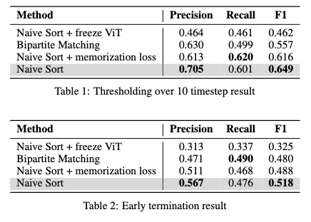
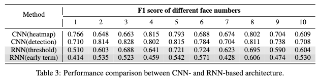
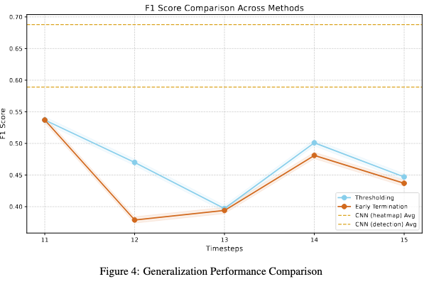

# YOCO You Only Count Once: Recurrent Visual Counting

In this work, we investigate the performance of <B>recurrent neural networks</B> in human face counting tasks. Our architecture combines pretrained ViT, LSTM and CNN. At each step, the same image is being input to model, and the output is a heatmap indicating the postion of **one** face currently being counted.

<figure>

</figure>

Our <B>key insights</B> are:
1. Recurrent counting method is less efficient and less accurate than the conventional approach of regressing all counting heatmap spots/coordinates in one forward pass.
2. Defining an order of counting helps improve the performance of recurrent counting.
3. Neural networks are yet to learn symbolic logic well, because the task can be readily transformed into an easy auto-regressive task by simply masking the counted faces.


## Tables
1. Main Result
<figure>

</figure>

2. Comparison with CNN
<figure>

</figure>

3. Generalization
<figure>

</figure>


## Counting Results

<figure>

</figure>

## Get Started
### 1. Set up environment

```bash
conda env create -f environment.yaml
```
### 2. Dataset Preparation
Download <I>dataset</I> and <I>trained model weights</I> from [YOCO](https://drive.google.com/drive/folders/0ADueAzOJAMuHUk9PVA?dmr=1&ec=wgc-drive-globalnav-goto), and then organize the directory of the repo as:
```plain
.
├── configs
├── data
├── datasets
│   └── YOCO3k
├── engine
│   ├── eval
│   └── train
├── figs
├── models
├── utils
├── weights
│   ├── cnn
│   └── rnn
├──environment.yaml
├── main_eval.py
├── main_train.py
└── README.md
```


### 2. Training

* RNN
    
    ```bash
    python main_train.py --model rnn --save_dir weights/rnn/save_folder --config_file configs/config.yaml --train_set datasets/YOCO3k/labels/train.txt 
    ```

* RNN with memorization loss

    ```bash
    python main_train.py --model sup --save_dir weights/rnn/save_folder --config_file configs/config.yaml --train_set datasets/YOCO3k/labels/train.txt 
    ```

* CNN

    ```bash
    python main_train.py --model cnn --save_dir weights/rnn/save_folder --config_file configs/config.yaml --train_set datasets/YOCO3k/labels/train.txt 
    ```

### 3. Evaluation

* RNN
    
    ```bash
    python main_eval.py --model rnn --config_file configs/config.yaml --val_set datasets/YOCO3k/labels/val.json
    ```

* RNN with memorization loss

    ```bash
    python main_eval.py --model sup --config_file configs/config.yaml --val_set datasets/YOCO3k/labels/val.json 
    ```

* CNN

    ```bash
    python main_eval.py --model cnn --config_file configs/config.yaml --val_set datasets/YOCO3k/labels/val.json
    ```

* Evaluation on New class

    Replace val_set value to
    ```bash
    --val_set datasets/YOCO3k/labels/gen.json
    ``` 

* Visualize heatmap
    Add following args after above script
    ```bash
    --visualize True --vis_dir your_vis_result_folder
    ``` 