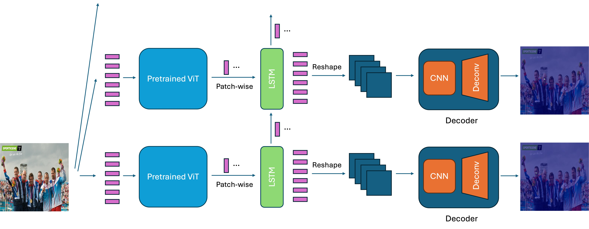

# YOCO You Only Count Once: Recurrent Visual Counting

In this work, we investigate the performance of recurrent neural networks in human face counting tasks. Our architecture combines pretrained ViT, LSTM and CNN. At each step, the same image is being input to model, and the output is a heatmap indicating the postion of **one** face currently being counted.

<figure>

</figure>

Our key insights are:
1. Recurrent counting method is less efficient and less accurate than the conventional approach of regressing all counting heatmap spots/coordinates in one forward pass.
2. Defining an order of counting helps improve the performance of recurrent counting.
3. Neural networks are yet to learn symbolic logic well, because the task can be readily transformed into an easy auto-regressive task by simply masking the counted faces.

## Counting Results

<figure>

</figure>

## Get Started
To train the model, 
```bash
python train.py
```

To evaluate the model,
```bash
python eval_accuracy.py --state_dict=MODEL_PATH
```

To generate heatmaps,
```bash
python eval_visual.py --state_dict=MODEL_PATH
```
